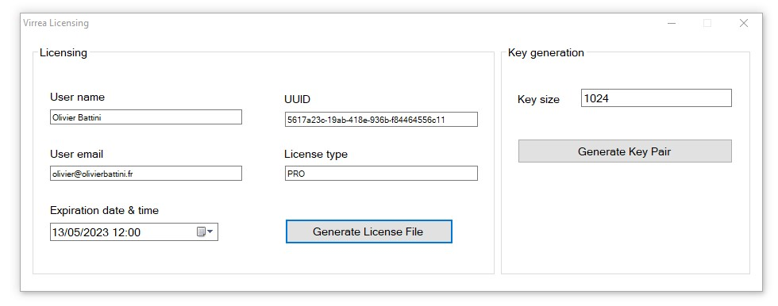

# Licensing



## How it works

A license file generated and signed with software private RSA key (1024 bits or more) is sent to the customer. The license information is then verified with the public RSA key by the licensed software.

## Example of generated license file

The license file contains a number of fields that are 

- License ID
- Licensee name
- Licensee email
- License type
- Expiration date & time
- RSA Signature to ensure license validity

```
<?xml version="1.0"?>

<License>
    <Name>Olivier Battini</Name>
    <Email>olivier@olivierbattini.fr</Email>
    <Type>PRO</Type>
    <Expiration>2023-05-13T12:00:24.0000000Z</Expiration>
    <Id>5617a23c-19ab-418e-936b-f84464556c11</Id>
    <Signature>TGHYQcvEidUGdjKG5GJ52g+Y+Aq8Hc9PxvAVGToacPtrK5dhRERhNxzRf0zJfND0xGbzK8UBCMzTQVnlsRNJvIYn9Ds9Z6TuQo+wbQ1Wm2N0eni60wdgGzksxSk9SYISODar+HQj8L0jpYXluRc7FUANkBtbFHCKMwyYPgxLU5k=</Signature>
</License>
```